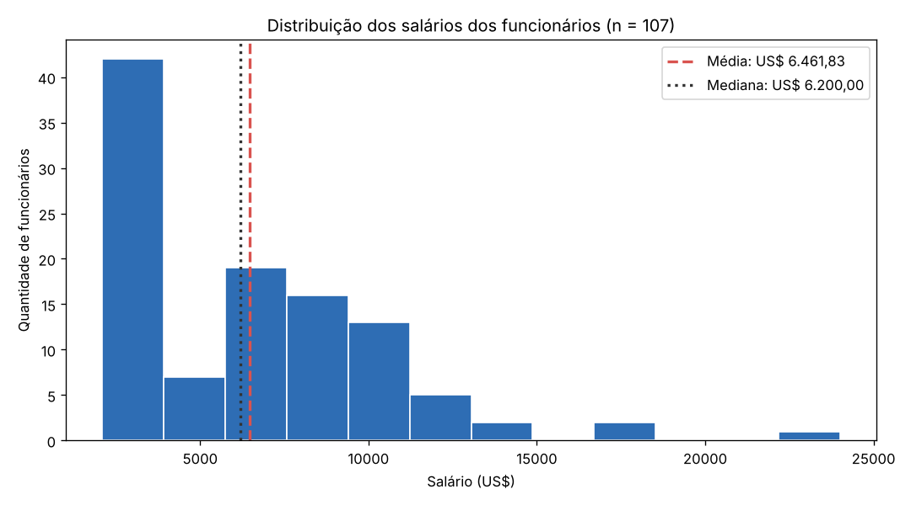
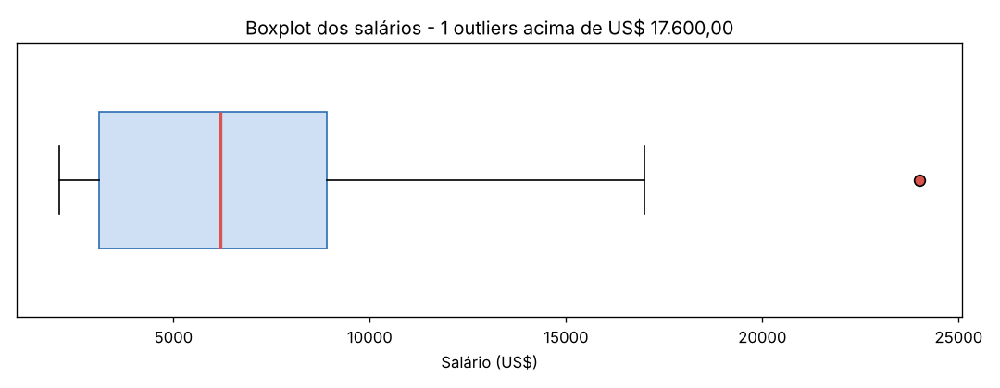
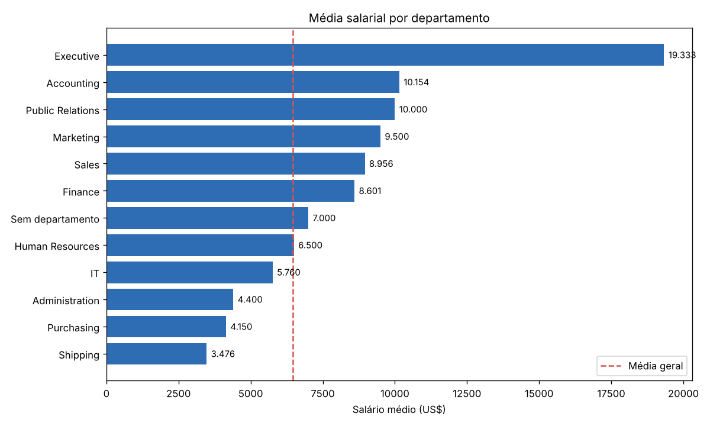
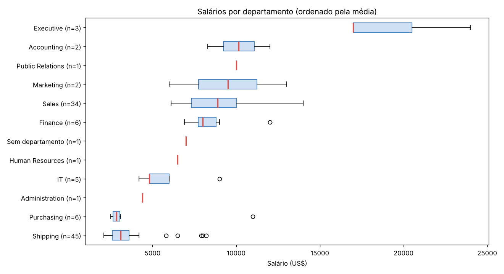
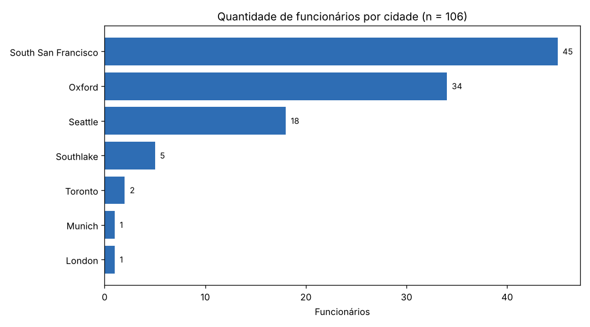

# Análise de RH com SQL e Python — Projeto de Recuperação (Módulo 1)

**Aluno:** Jandir Medeiros dos Reis
**Curso:** Visualização de Dados e Business Intelligence — Turma T1/T2 (SCTEC · SENAI/SC)
**Atividade:** Situação de Aprendizagem — Projeto de Recuperação do Módulo 1

---

## 1. Objetivo

Atuar como analista de dados da área de Recursos Humanos para responder duas perguntas:

1. **Quais departamentos e cargos concentram os maiores salários?**
2. **Como os funcionários estão distribuídos entre cidades, países e regiões?**

Os dados vêm do banco **Oracle FreeSQL**, esquema **HR (Human Resources)**. As consultas foram feitas em SQL (com `LEFT JOIN` e `WHERE`), exportadas para CSV e analisadas em Python com estatística descritiva e gráficos.

## 2. Estrutura do repositório

```
.
├── README.md                  # esta documentação
├── requirements.txt           # bibliotecas Python usadas
├── analise_rh.py              # análise exploratória (EDA) em Python
├── sql/
│   └── consultas_hr.sql       # Query 1 e Query 2
├── data/
│   ├── query_01.csv           # resultado da Query 1 (107 linhas)
│   └── query_02.csv           # resultado da Query 2 (106 linhas)
└── imagens/                   # gráficos gerados pelo script
```

## 3. Tabelas utilizadas (esquema HR)

| Tabela | O que guarda | Ligação usada |
|---|---|---|
| `EMPLOYEES` | funcionários, salário, cargo e departamento | tabela base das duas consultas |
| `DEPARTMENTS` | nome do departamento e local onde fica | `EMPLOYEES.DEPARTMENT_ID` |
| `JOBS` | nome do cargo e faixa salarial (mínimo e máximo) | `EMPLOYEES.JOB_ID` |
| `LOCATIONS` | cidade, estado e país de cada local | `DEPARTMENTS.LOCATION_ID` |
| `COUNTRIES` | nome do país e região | `LOCATIONS.COUNTRY_ID` |
| `REGIONS` | nome da região (continente) | `COUNTRIES.REGION_ID` |

Caminho da Query 2: `EMPLOYEES → DEPARTMENTS → LOCATIONS → COUNTRIES → REGIONS`.

## 4. Consultas SQL

O código completo está em [`sql/consultas_hr.sql`](sql/consultas_hr.sql).

**Query 1 — Salários por departamento e cargo**
- `EMPLOYEES` + `LEFT JOIN DEPARTMENTS` + `LEFT JOIN JOBS` (2 LEFT JOIN)
- Filtro: `WHERE e.salary IS NOT NULL`
- Traz nome, departamento, cargo, salário e a faixa salarial oficial do cargo (`MIN_SALARY` e `MAX_SALARY`).
- Resultado: **107 funcionários** → `data/query_01.csv`

**Query 2 — Funcionários por cidade, país e região**
- `EMPLOYEES` + `LEFT JOIN DEPARTMENTS` + `LEFT JOIN LOCATIONS` + `LEFT JOIN COUNTRIES` + `LEFT JOIN REGIONS` (4 LEFT JOIN)
- Filtro: `WHERE r.region_name IS NOT NULL`
- Resultado: **106 funcionários** → `data/query_02.csv`

> **Por que LEFT JOIN?** Ele mantém todos os funcionários, mesmo quem não tem departamento. Assim a funcionária **Kimberely Grant** (Sales Representative) aparece na Query 1 com departamento vazio. Na Query 2 ela é retirada pelo `WHERE`, porque sem departamento não há como saber o local de trabalho. Por isso a Query 2 tem uma linha a menos.

### Como os dados foram extraídos
1. Acessei o [FreeSQL](https://freesql.com/) e selecionei o esquema **Human Resources (HR)** no navegador de objetos.
2. Executei cada consulta na *SQL Worksheet* e conferi o resultado.
3. Exportei o resultado de cada consulta em CSV (`query_01.csv` e `query_02.csv`).

## 5. Análise em Python (EDA)

O script `analise_rh.py` segue estas etapas:

1. **Leitura** dos dois CSVs com `pandas` e visão geral (linhas, colunas e tipos).
2. **Qualidade dos dados:** contagem de nulos e de duplicados.
   - 1 funcionário sem departamento → rotulado como *"Sem departamento"* (não foi apagado).
   - 1 local sem estado/província (Londres) → rotulado como *"Não informado"*.
   - 0 funcionários duplicados.
3. **Estatística descritiva do salário:** média, mediana, mínimo, máximo, desvio padrão, quartis e outliers (regra do IQR).
4. **Comparação por departamento e por cargo** (média, mediana, mínimo, máximo e folha total).
5. **Posição do salário dentro da faixa do cargo** (comparando com `MIN_SALARY` e `MAX_SALARY`).
6. **Distribuição geográfica:** quantidade e % de funcionários por região, país e cidade, e salário médio por cidade (juntando as duas consultas pelo `employee_id`).
7. **Gráficos** salvos na pasta `imagens/`.

## 6. Principais resultados

### Estatística descritiva do salário (107 funcionários)

| Medida | Valor (US$) |
|---|---|
| Média | 6.461,83 |
| Mediana | 6.200,00 |
| Mínimo | 2.100,00 (Stock Clerk) |
| Máximo | 24.000,00 (President) |
| Desvio padrão | 3.909,58 |
| 1º quartil / 3º quartil | 3.100,00 / 8.900,00 |
| Limite para outlier (Q3 + 1,5 × IQR) | 17.600,00 |





### Salários por departamento

| Departamento | Funcionários | Média (US$) | Mediana (US$) |
|---|---|---|---|
| Executive | 3 | 19.333 | 17.000 |
| Accounting | 2 | 10.154 | 10.154 |
| Public Relations | 1 | 10.000 | 10.000 |
| Marketing | 2 | 9.500 | 9.500 |
| Sales | 34 | 8.956 | 8.900 |
| Finance | 6 | 8.601 | 8.000 |
| Human Resources | 1 | 6.500 | 6.500 |
| IT | 5 | 5.760 | 4.800 |
| Administration | 1 | 4.400 | 4.400 |
| Purchasing | 6 | 4.150 | 2.850 |
| Shipping | 45 | 3.476 | 3.100 |





### Salários por cargo
- **Maiores médias:** President (24.000), Administration Vice President (17.000), Marketing Manager (13.000), Sales Manager (12.200) e Finance/Accounting Manager (12.008).
- **Menores médias:** Purchasing Clerk (2.780), Stock Clerk (2.785), Shipping Clerk (3.215) e Administration Assistant (4.400).
- Em média, os salários estão em **34,8% da faixa salarial do cargo** (perto do mínimo). Só 1 pessoa está no teto da faixa: Daniel Faviet (Accountant, 9.000).

### Distribuição geográfica (106 funcionários com local definido)

| Região | Funcionários | % |
|---|---|---|
| Americas | 70 | 66,0% |
| Europe | 36 | 34,0% |

| Cidade (país) | Funcionários | Salário médio (US$) |
|---|---|---|
| South San Francisco (EUA) | 45 | 3.476 |
| Oxford (Reino Unido) | 34 | 8.956 |
| Seattle (EUA) | 18 | 8.845 |
| Southlake (EUA) | 5 | 5.760 |
| Toronto (Canadá) | 2 | 9.500 |
| Munich (Alemanha) | 1 | 10.000 |
| London (Reino Unido) | 1 | 6.500 |



## 7. Insights

1. **Salários concentrados na base:** a média (6.462) é maior que a mediana (6.200) e o histograma tem uma cauda longa à direita. Poucos salários altos puxam a média para cima, então a **mediana representa melhor o "salário típico"**.
2. **Liderança concentra os maiores salários:** o departamento *Executive* (3 pessoas) tem média de 19.333, quase 3 vezes a média geral. O único outlier geral é o Presidente (24.000).
3. **Dois departamentos são 74% da empresa:** *Shipping* (45) e *Sales* (34) somam 79 dos 107 funcionários, mas com perfis opostos: Shipping tem a menor média (3.476) e Sales uma das maiores (8.956).
4. **Outliers dentro dos departamentos são os gestores:** em Shipping, Purchasing, IT e Finance os pontos fora do boxplot são gerentes/coordenadores. A diferença entre gestão e operação é grande nesses setores.
5. **Localização acompanha a função:** South San Francisco reúne o setor de Shipping (salários baixos) e Oxford reúne todo o setor de Sales (salários altos). A diferença de salário entre cidades vem **do tipo de cargo**, não do custo de vida.
6. **Qualidade do cadastro:** 1 funcionária sem departamento e 1 local sem estado. São poucos casos, mas mostram por que o LEFT JOIN é importante para não "sumir" com registros sem perceber.

## 8. Como executar

**Pré-requisitos:** Python 3.10 ou superior e Git.

```bash
# 1. Clonar o repositório
git clone https://github.com/profjandirreis-sys/projeto-recuperacao-modulo1-rh.git
cd projeto-recuperacao-modulo1-rh

# 2. (Opcional) criar ambiente virtual
python -m venv .venv
# Windows: .venv\Scripts\activate   |   Linux/Mac: source .venv/bin/activate

# 3. Instalar as bibliotecas
pip install -r requirements.txt

# 4. Rodar a análise
python analise_rh.py
```

O resultado aparece no terminal e os gráficos são salvos na pasta `imagens/`.

**Para refazer as consultas:** abra o [FreeSQL](https://freesql.com/), selecione o esquema *Human Resources (HR)*, cole cada consulta de `sql/consultas_hr.sql` na *SQL Worksheet*, execute (Ctrl+Enter) e use **Download → CSV**.

## 9. Organização do projeto (checklist)

- [x] Montar a Query 1
- [x] Montar a Query 2
- [x] Exportar os dados para CSV
- [x] Ler os CSVs no Python
- [x] Fazer a análise exploratória
- [x] Criar os gráficos (histograma e boxplot)
- [x] Escrever os resultados no README.md
- [x] Revisar o projeto final

Cada etapa foi desenvolvida em uma *branch* própria (`feature/consultas-sql`, `feature/exportacao-csv`, `feature/analise-python`, `docs/readme`) e depois unida à `main`.

## 10. Sugestões de melhoria

- Conectar o Python direto ao FreeSQL com `oracledb` (SQL\*Net), sem exportar CSV manualmente.
- Usar a tabela `JOB_HISTORY` para analisar promoções e tempo de casa (`HIRE_DATE`) versus salário.
- Incluir a comissão (`COMMISSION_PCT`) para calcular a remuneração total da equipe de vendas.
- Criar um dashboard interativo (Looker Studio ou Power BI) com filtros por departamento e região.
- Comparar os salários com dados de mercado para avaliar a faixa de contratação de novos colaboradores.

## 11. Vídeo de apresentação

🎥 Link do vídeo: _(adicionar o link aqui)_
